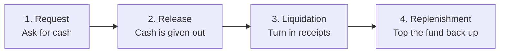
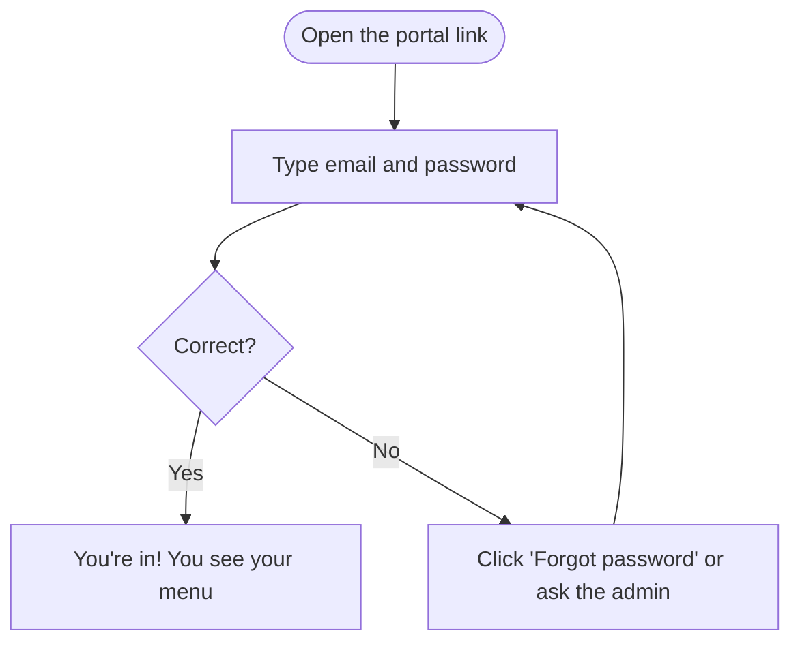
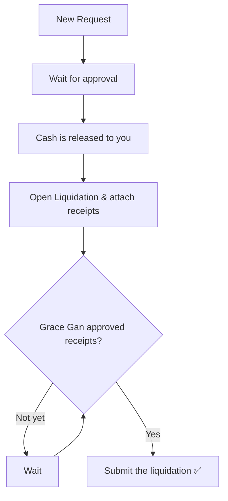
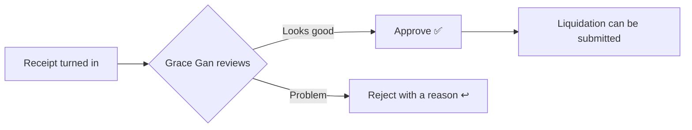

# Petty Cash Portal — Easy User Guide

Welcome! This guide is for **everyone**, even if you have never used the app
before. It explains, in plain words, how to log in and how to do your job.

Take your time. You can't "break" anything — every action is saved, and the
administrator can recover data if needed.

---

## What is this app for?

It keeps track of **petty cash** (the small pool of company money used for
day-to-day expenses). It follows the money through four simple stages:

1. Someone **asks** for cash.
2. The cash is **given out**.
3. Receipts are **turned in** to show how it was spent.
4. The fund is **topped back up** so it's ready for next time.

Here is the whole journey in one picture:

> **Reimbursement** is a separate thing: it's for paying an employee **back**
> for money they already spent from their own pocket. It has its own tab.

---

## Words you'll see (mini dictionary)

| Word | What it really means |
|------|----------------------|
| **Petty cash** | A small amount of company money for everyday expenses. |
| **Request** | Asking for petty cash before you get it. |
| **Release / Disbursement** | The moment the cash is actually handed out. |
| **Release Ledger** | The list that records every cash release. |
| **Liquidation** | Turning in receipts to prove how the cash was spent. |
| **Receipt / Official Receipt (OR)** | The proof of purchase you attach. |
| **Replenishment** | Refilling the fund back to its normal amount. |
| **Reimbursement** | Paying an employee back for expenses they paid themselves. |
| **Plant** | A company/branch (Manila, Warner, Disney, RG and Co.). |
| **Custodian** | The person who takes care of the cash for a plant. |
| **Aging** | A report that shows advances not liquidated on time. |
| **Dashboard** | The home screen with balances and alerts. |

---

## Step 1 — Log in

1. Open the portal link in **Google Chrome** or **Microsoft Edge**.
2. Type your **email** and **password**.
3. Click **Sign in**.

You will only see the buttons and plants that belong to your job — that's normal.

**Forgot your password?** Click **Forgot password** on the login screen to get a
reset email, or ask the administrator (Grace Gan) to reset it for you. After you
log in, you can set a new password anytime using **Change password** at the
bottom of the left menu.

**To leave**, click **Sign out** at the bottom of the left menu.

---

## Step 2 — Find your name and role

Every person has an account. Find yourself in this list to know what you can do
and which plants you'll see.

| Your email | Your name | Your role | Plants you see |
|------------|-----------|-----------|----------------|
| `a1plusadmin@a1plus.com` | Grace Gan | Administrator (the boss account) | All |
| `accounting@a1plus.com` | Accounting Department | Accounting (full access) | All |
| `finance@a1plus.com` | Finance Department | Finance | All |
| `puradr@a1plus.com` | Pura Barloso | Custodian | Disney + RG and Co. |
| `lita@a1plus.com` | Angelita Bayani | Custodian | Warner |
| `mauwi@a1plus.com` | Maureen Felix | Custodian | Manila |
| `pcfrequestordisney@a1plus.com` | PCF Requestor – Disney | Requestor | Disney |
| `pcfrequestormanila@a1plus.com` | PCF Requestor – Manila | Requestor | Manila |
| `pcfrequestorrgandco@a1plus.com` | PCF Requestor – RG and Co. | Requestor | RG and Co. |

---

## Step 3 — What can I do? (simple version)

Think of the roles like this:

- **Requestor** = *"I fill in the forms."* You prepare requests and liquidations,
  but you don't hand out cash or approve anything.
- **Custodian** = *"I hold the cash for my plant."* You approve requests, release
  cash, and refill the fund.
- **Finance** = *"I oversee all plants"* — same as a custodian but for every
  plant, plus the master data.
- **Accounting** = *"I run the system"* — everything, plus managing users and
  settings.
- **Administrator (Grace Gan)** = *"I have the final say"* — the only one who
  approves receipts, and the only one who can delete or restore data.

Here's the same thing as a checklist:

| Can you… | Requestor | Custodian | Finance | Accounting | Administrator |
|----------|:---------:|:---------:|:-------:|:----------:|:-------------:|
| Create a request | ✅ | ✅ | ✅ | ✅ | ✅ |
| Approve a request | ❌ | ✅ | ✅ | ✅ | ✅ |
| Release cash | ❌ (view only) | ✅ | ✅ | ✅ | ✅ |
| Prepare a liquidation | ✅ | ✅ | ✅ | ✅ | ✅ |
| **Approve receipts** | ❌ | ❌ | ❌ | ❌ | ✅ *(only Grace Gan)* |
| Do a reimbursement | ✅ | ✅ | ✅ | ✅ | ✅ |
| Replenish the fund | ❌ | ✅ | ✅ | ✅ | ✅ |
| See reports & aging | ❌ | ✅ | ✅ | ✅ | ✅ |
| Edit master data | ❌ | ❌ | ✅ | ✅ | ✅ |
| Manage users/settings | ❌ | ❌ | ❌ | ✅ | ✅ |
| Delete a record | ❌ | ❌ | ❌ | ❌ | ✅ *(only Grace Gan)* |

> ⭐ **Important:** Only **Grace Gan** can approve receipts. A liquidation cannot
> be finished until she has approved every receipt attached to it.

---

## Step 4 — How to do your job

Pick the section that matches your role.

### 👩‍💻 If you are a Requestor
You prepare paperwork. You cannot approve or hand out cash.

1. Click **Petty Cash Requests** → **New Request**.
2. Fill in: who it's for, the department, the reason, the amount, and the
   approver. Click **Submit**.
3. Later, when the cash is released, open **Liquidation** to record how it was
   spent and **attach the receipts**.
4. Wait for **Grace Gan** to approve the receipts, then submit the liquidation.
5. Use **Transaction History** anytime to check the status of your submissions.

### 💰 If you are a Custodian
You take care of the cash for your plant.

1. Start at the **Dashboard** to see balances and anything that needs attention.
2. In **Petty Cash Requests**, review and **approve** (or reject) requests.
3. In **Release Ledger**, **release the cash** for approved requests.
4. When receipts come in, check the **Liquidation** (final approval still comes
   from Grace Gan).
5. Once expenses are liquidated, go to **Replenishment** to **refill the fund**.
6. Check **Liquidation Aging** to spot advances that are overdue.

### 🧾 If you are Finance
Same as a Custodian, but for **all plants** — plus you can edit **Funds & Master
Data** (plants, custodians, chart of accounts). You don't manage user accounts.

### 🗂️ If you are Accounting
You can do everything Finance can, **plus User Management and System Settings**
(including backup/recovery tools). You see all plants.

### 👑 If you are the Administrator (Grace Gan)
You have full control and are the **only** person who can:

- **Approve or reject receipts and final liquidations.**
- **Delete** a record.
- **Restore** lost data from **System Settings → Data Integrity → Recovery
  snapshots**.

---

## Step 5 — Approving receipts (Grace Gan only)

1. Open **Liquidation** (or look at the Dashboard alert
   *"Receipts Waiting for Grace Gan's Approval"*).
2. Look at each receipt and click **Approve** (or reject with a short reason).
3. When **all** receipts on a liquidation are approved, the preparer can submit
   it as final.

---

## Working at the same time as others

- Many people can use the app **at the same time**. The app saves each entry on
  its own, so your work won't erase someone else's.
- Just avoid **two people editing the exact same record at the same second** — if
  that happens, the last save wins for that one item.
- After you save, wait a second or two before closing the tab so it can finish
  saving to the shared database.

---

## If something goes wrong

| What you see | What to do |
|--------------|-----------|
| Can't log in | Double-check the email/password. Use **Forgot password** or ask Grace Gan. |
| A button or tab is missing | It's simply not part of your role — that's normal. |
| The numbers look old | Refresh the page: press **Ctrl + F5**. |
| "Cloud database not configured" | The app lost its connection — tell the administrator. |
| I deleted something by mistake | Ask Grace Gan — she can restore it from **System Settings → Data Integrity → Recovery snapshots**. |

---

## Quick reminders

- ✅ You can't permanently break anything — data can be recovered.
- ✅ You only see what your role needs.
- ✅ Attach clear receipts; blurry ones may be rejected.
- ✅ Only **Grace Gan** approves receipts and can delete/restore.
- ✅ Refresh (**Ctrl + F5**) if something looks out of date.

---

*Need the technical setup (for IT)? See [README.md](README.md).*
